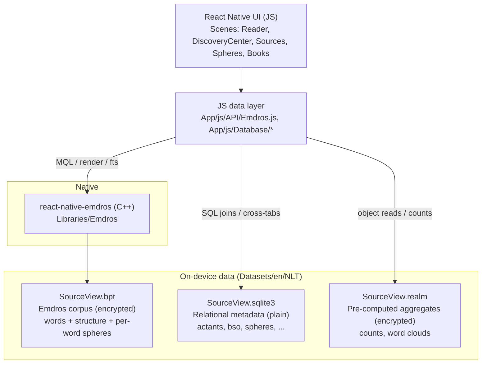
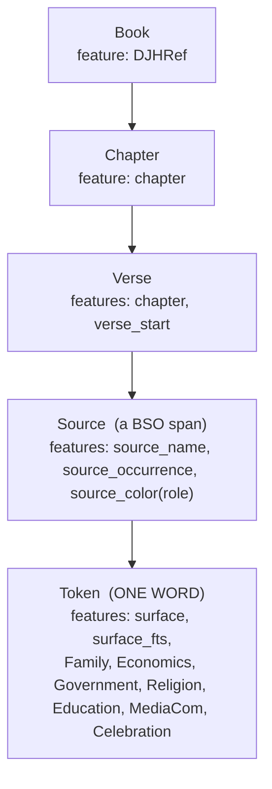
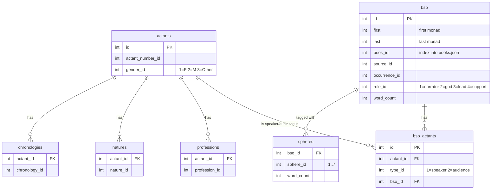
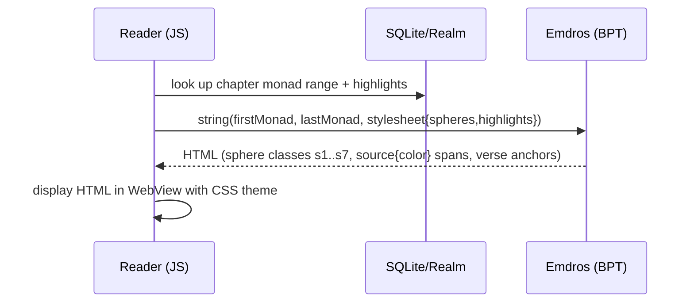
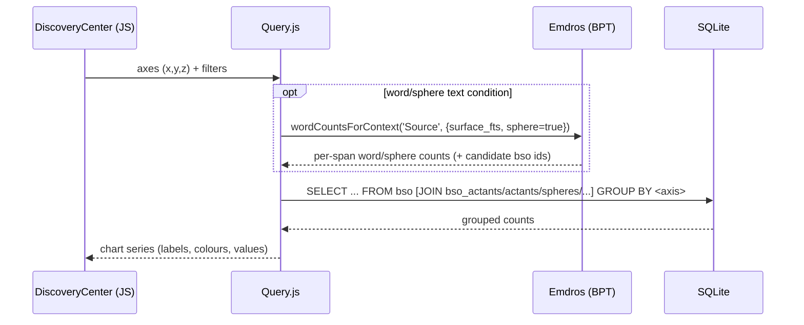

# Source View Bible — Engineering & Data Handoff

> **Audience:** an app engineer / product team picking this project up cold.
> **Purpose:** explain what the original app was, how it functioned, the exact
> back‑end data structures and how they relate, what survives today, and where the
> opportunities are to build new tools on top of this data property.
>
> Companion documents in this repo:
> - `DATA_RECOVERY.md` — how to extract/decrypt every artifact (keys, commands, full
>   lookup tables, recovery proof).
> - `tools/extract_metadata.py` — produces portable JSON/CSV of the metadata.
> - `tools/dump_words.cpp` + `tools/build_dump_words.sh` — reads the encrypted word corpus.

---

## Table of contents

1. [The product in one paragraph](#1-the-product-in-one-paragraph)
2. [What made it unique (the data property)](#2-what-made-it-unique-the-data-property)
3. [How the app functioned (feature by feature)](#3-how-the-app-functioned-feature-by-feature)
4. [System architecture](#4-system-architecture)
5. [The data model in depth](#5-the-data-model-in-depth)
6. [How the pieces relate (the monad bridge)](#6-how-the-pieces-relate-the-monad-bridge)
7. [Runtime data flows](#7-runtime-data-flows)
8. [Data dictionary (quick reference)](#8-data-dictionary-quick-reference)
9. [What we have vs. what is lost](#9-what-we-have-vs-what-is-lost)
10. [Access patterns & example queries](#10-access-patterns--example-queries)
11. [Opportunities: what could be built from this property](#11-opportunities-what-could-be-built-from-this-property)
12. [Recommended target architecture for a rebuild](#12-recommended-target-architecture-for-a-rebuild)
13. [Handoff checklist & file map](#13-handoff-checklist--file-map)

---

## 1. The product in one paragraph

The Source View Bible ("SphereView") is a mobile Bible reader (React Native, iOS +
Android) built on the **New Living Translation** text. Its differentiator is that the
entire Bible was **annotated at the word level**: every word is attributed to a
**speaker** (and, where applicable, an **audience**), and tagged with which of seven
**"spheres of society"** it belongs to. Speakers and audiences ("actants") carry
attributes — **gender, nature, vocation/profession, and chronology (era)**. On top of
that annotation the app offered a colour‑coded reader, a discovery/analytics engine, and
browsing by speaker, sphere and book.

## 2. What made it unique (the data property)

Almost every Bible app addresses text only down to **book → chapter → verse**. This app
went one level deeper — to the **word** — and layered structured metadata onto it:

| Dimension | Example question it can answer |
| --- | --- |
| Speaker (source) | "Show me everything **God** says." |
| Audience (recipient) | "What did Jesus say **to the Pharisees**?" |
| Gender | "How many words are spoken **by women**?" |
| Nature | "Show all speech by **angelic** vs **human** beings." |
| Profession / vocation | "Everything spoken by a **King** / **Shepherd** / **Prophet**." |
| Chronology (era) | "Filter to speakers from the **700s BC**." |
| Sphere of society | "Highlight all **Economics** or **Family** content." |
| Role | narration vs. God vs. lead vs. supporting character (drove colour). |

This annotation is the **core intellectual property** and it is **translation‑independent**
— it is anchored to word *positions*, so it can be re‑applied to any licensed Bible text.

## 3. How the app functioned (feature by feature)

Source: `App/js/Scenes/*`. The app was organised into these scenes:

- **Reader** (`Scenes/Reader`) — the scripture reader. Renders a chapter as HTML (in a
  WebView) with:
  - **sphere highlighting** (words/verses get CSS classes `s1…s7` per sphere),
  - **speaker colour‑coding** (each `Source` span gets a `source{color}` class by role),
  - verse/chapter anchoring, footnotes, poetry/prose layout, embedded quotations.
  The HTML is produced by Emdros itself via a JSON **stylesheet**
  (`App/js/API/scripture-stylesheet.json`) applied to a monad range.
- **Discovery Center** (`Scenes/DiscoveryCenter`) — the analytics engine. The user picks
  **x / y / z axes** (from: book, chronology, name, gender, nature, profession, role,
  sphere, words) plus **filters**, and the app builds a SQL query over the relational DB
  (and, for word/sphere text conditions, an Emdros query) to produce **charts** and
  cross‑tabulations. This is implemented by `Scenes/DiscoveryCenter/Query.js` — the single
  most important file for understanding analytical capability.
- **Sources** (`Scenes/Sources`) — browse/search **actants** (speakers & recipients),
  filter them by gender/nature/profession/chronology/role, and drill into the books and
  words associated with a source.
- **Spheres** (`Scenes/Spheres`) — browse the seven spheres, read their editorial
  overviews, see **key passages** and the words most associated with each sphere.
- **Books** (`Scenes/Books`) — per‑book overview and word clouds.
- **Bookmarks** (`Scenes/Bookmarks`) — user bookmarks (stored in the preferences Realm).
- **Onboarding / About / Discover** — intro flows and landing.

Cross‑cutting services live in `App/js/API` (Emdros bridge, stylesheets, store) and
`App/js/Database` (Realm + SQLite access, a small SQL predicate builder).

## 4. System architecture

React Native (v0.38, 2016) app with a **custom native module for Emdros** and **three
distinct on‑device data stores**, each chosen for a different job.



Why three stores:

| Store | Engine | Role | Encryption |
| --- | --- | --- | --- |
| `SourceView.bpt` | **Emdros** (text database, MQL) | the annotated **text**: words, book/chapter/verse structure, speaker spans, **per‑word sphere flags**; also renders HTML and does full‑text search | Emdros page codec (key committed) |
| `SourceView.sqlite3` | **SQLite** | the **relational metadata** used for filtering & analytics (actants, spans, links, spheres, professions, natures, chronologies) | none (plain) |
| `SourceView.realm` | **Realm** | **pre‑computed aggregates** for fast UI (per‑book/actant/sphere counts, word clouds, source relations) — derived, regenerable | Realm 64‑byte key (committed) |

The whole Emdros engine source is vendored at `Libraries/Emdros/src/` and the native
bridge at `Libraries/Emdros/{ios,android}`.

## 5. The data model in depth

### 5.1 Monads — the universal address

Emdros numbers every word/token position in reading order with an integer **monad**
(Genesis 1:1 "In" is monad 3; the last annotated span ends near monad **1,805,074**).
**Every dataset is keyed, directly or indirectly, to monads.** This is the glue.

### 5.2 The Emdros corpus (`SourceView.bpt`) object model

Emdros stores *objects* (each spanning a set of monads) with typed *features*:



- **Token** is the atom: one per word, carrying the word text (`surface`), a
  search‑normalised form (`surface_fts`), and **seven boolean sphere flags**.
- **Source** objects are the speaker spans (this is the corpus‑side of a "BSO").
- Structural objects (`Paragraph`, `Poetry`, `Stanza`, `Note`, `EmbeddedQuotation`,
  `Italics`, table markup, etc.) exist for rendering — see `scripture-stylesheet.json`.

### 5.3 The relational metadata (`SourceView.sqlite3`)



Row counts (verified): actants 1,282 · bso 6,485 · bso_actants 13,486 · spheres 23,952 ·
professions 533 · chronologies 1,371 · natures 1,144. Distinct **speakers 893**,
distinct **recipients 989**.

- **`bso`** ("Book‑Source‑Occurrence") is the central table: one row = one contiguous
  span `[first…last]` of words spoken by one source, the *n*‑th time that source appears
  in a book, with a role and a word count.
- **`bso_actants`** links each span to its people: `type_id=1` = the **speaker**,
  `type_id=2` = an **audience** member. (A span can have multiple audience members.)
- **`spheres`** gives per‑span word counts per sphere.
- **`professions` / `natures` / `chronologies`** are many‑to‑many attributes of an actant.

### 5.4 The aggregates (`SourceView.realm`)

Realm holds denormalised, pre‑computed objects for snappy UI (schema in
`Kraken/app/SourceViewSchema.js`): `Book`, `Chapter`, `Actant`, `Sphere`,
`SourceRelation`, plus label objects (`Profession`, `Nature`, `Chronology`) and reusable
`Count` / `Content` structures. These carry things like `wordCount`, `sphereCounts`,
`sourceTypeCounts`, word‑cloud lists, book/sphere overviews and key passages. **All of it
is derivable** from the corpus + relational DB, so treat it as a cache, not a source of
truth.

## 6. How the pieces relate (the monad bridge)

The three stores are joined by monads:

```
Emdros Token (monad m, surface, sphere flags)
        │  m ∈ [bso.first, bso.last]
        ▼
SQLite  bso  ── bso_actants ── actants ── professions/natures/chronologies
        │                          │
        └── spheres                └── gender
        ▼
Realm   pre-computed counts/word-clouds for Book / Actant / Sphere
```

So for **any word** you can determine: its text and sphere flags (Emdros), which span it
belongs to and therefore its speaker/role/audience (SQLite `bso` + `bso_actants`), and
the speaker's gender/vocation/nature/era (SQLite attribute tables). That composition is
the whole product.

## 7. Runtime data flows

### 7.1 Rendering a chapter in the Reader



The stylesheet (`App/js/API/Emdros.js` + `scripture-stylesheet.json`) injects, per word,
the active sphere CSS classes and, per source span, the speaker colour.

### 7.2 Running a Discovery query



`Query.js` dynamically assembles the `FROM`/`JOIN`/`WHERE`/`GROUP BY` based on which axes
and filters are active — e.g. a "source" axis joins `bso_actants type_id=1 → actants`; a
"sphere" axis joins the `spheres` table; a "word" filter is resolved through Emdros
full‑text search and folded back into the SQL as a `bso.id IN (...)` constraint.

## 8. Data dictionary (quick reference)

Full enumerations (all 52 professions, 18 chronologies, etc.) are in `DATA_RECOVERY.md §4`.
Essentials:

- **gender_id:** 1 = Female, 2 = Male, 3 = Other/Unspecified (groups, deity).
- **role_id (source_color):** 1 = narrator, 2 = god, 3 = lead, 4 = support.
- **bso_actants.type_id:** 1 = speaker, 2 = audience.
- **sphere_id → key → Emdros token feature:**
  1 family→`Family`, 2 economics→`Economics`, 3 government→`Government`,
  4 religion→`Religion`, 5 education→`Education`, 6 communication→`MediaCom`,
  7 celebration→`Celebration`.
- **nature_id:** 1 Angelic, 2 Demonic, 3 Divine, 4 Human, 5 Other.
- **profession_id:** 52 vocations (Shepherd, King, Prophet, Fisherman, Priest, …).
- **chronology_id:** 18 century bands, each with a year range (e.g. `Chron_700s_BC` = −799…−700).
- **book_id:** 1‑based index into `Kraken/app/books.json` (66 books, canonical order).

## 9. What we have vs. what is lost

**We have (all in this repo):**

- ✅ The full **relational metadata**, unencrypted and queryable now (`SourceView.sqlite3`).
- ✅ The full **word corpus** with text + per‑word sphere flags (`SourceView.bpt`) — the
  **decryption key and the Emdros engine source are both committed**, and reading it has
  been proven end‑to‑end (see `DATA_RECOVERY.md §5`).
- ✅ The **human‑readable source seeds** and all label tables (`Kraken/db/seeds`, `Kraken/app`).
- ✅ The **pipeline** that built everything (`Kraken/*.rb`, migrations, `sqlite-to-bpt.sh`).
- ✅ The complete **React Native app source** and the **Emdros native module**.

**Lost (external, never in this repo):**

- ❌ `SVB2/sphereview.sqlite3` — the original *master authoring* Emdros database. Its
  **outputs all survive** here, so the practical impact is minimal (see `DATA_RECOVERY.md §8`).

**Legal note:** the *word text* is the NLT (© Tyndale House) — licensed, not owned.
Recoverable for engineering, but a new product that ships the NLT text needs an NLT
licence. The **annotation** (spheres, speakers, actant attributes) is the proprietary
asset and is translation‑independent.

## 10. Access patterns & example queries

**Relational (SQLite) — works today, no build:**

```sql
-- Everything God says, with reference and word count:
SELECT b.reference, b.word_count
FROM bso b
JOIN bso_actants ba ON ba.bso_id = b.id AND ba.type_id = 1   -- speaker
JOIN actants a ON a.id = ba.actant_id
WHERE a.id = (SELECT id FROM actants /* God */ ) ;

-- Total words per sphere across the Bible:
SELECT sphere_id, SUM(word_count) FROM spheres GROUP BY sphere_id;

-- Words spoken by women (gender_id = 1):
SELECT SUM(b.word_count)
FROM bso b
JOIN bso_actants ba ON ba.bso_id=b.id AND ba.type_id=1
JOIN actants a ON a.id=ba.actant_id
WHERE a.gender_id = 1;
```

**Corpus (Emdros MQL) — needs the engine (vendored) + key:**

```
SELECT ALL OBJECTS IN {1-8000}
WHERE [Token Family=true GET surface]        -- every Family-tagged word in Genesis 1
GO
```

**One‑shot portable export:** `python3 tools/extract_metadata.py` → `build/metadata/*.json|csv`
(actants, spans with speaker/audience/role/spheres, lookups).

## 11. Opportunities: what could be built from this property

The annotation is a rich, queryable knowledge graph over scripture. Ideas, grouped by
how much new work they need:

**Low effort (use `SourceView.sqlite3` / the extractor output directly):**
- A **public data API / dataset release** (JSON/Parquet) of spans → speaker/audience/
  role/spheres for researchers and other apps.
- **Analytics dashboards**: "who speaks most", words per sphere per book, gender/vocation
  distributions, era timelines — the Discovery Center as a web app.
- **Study filters/search**: "show passages where a *Prophet* speaks about *Government*".

**Medium effort (join corpus words + metadata into one dataset):**
- A **word‑level tagged corpus** (monad → text + spheres + speaker + audience + attributes)
  as a single file, powering a modern reader with sphere highlighting and speaker colour.
- **Cross‑translation reuse:** because tags are position‑anchored, align them to another
  licensed translation and re‑ship the annotation.
- **Semantic/AI layers:** embeddings over spans keyed by sphere/speaker for
  retrieval‑augmented study tools, "ask who said…" assistants, thematic recommendations.

**Higher effort (product):**
- A new cross‑platform reader (see §12) with the sphere/speaker visualisations, but on a
  modern, engine‑neutral data backend.

## 12. Recommended target architecture for a rebuild

The original relied on Emdros + Realm on‑device. For a new build, decouple the *data* from
those engines:

1. **Canonical dataset (engine‑neutral):** produce one **word‑level table** —
   `monad, surface(optional/licensed), book, chapter, verse, speaker, role, audience[],
   spheres[]` — plus dimension tables for actants and labels. Store as Parquet/JSONL (or a
   normalised Postgres/SQLite schema mirroring §5.3). This is derived once from
   `SourceView.bpt` + `SourceView.sqlite3` (see `DATA_RECOVERY.md §6`).
2. **Serve** it via a small API (or bundle SQLite for offline apps). No Emdros needed at
   runtime once the words are extracted; sphere highlighting becomes a simple per‑word
   flag lookup.
3. **Text licensing:** keep the annotation separate from the copyrighted translation text
   so you can ship annotation freely and drop in whatever Bible text you are licensed for.
4. **UI:** re‑implement the reader (sphere classes per word, speaker colour per span) and
   the discovery charts against the new API — the query logic in
   `Scenes/DiscoveryCenter/Query.js` is a complete functional spec to port.

## 13. Handoff checklist & file map

| You need… | Look here |
| --- | --- |
| Relational metadata (now) | `Datasets/en/NLT/SourceView.sqlite3` |
| Word text + per‑word spheres | `Datasets/en/NLT/SourceView.bpt` (+ key in `DATA_RECOVERY.md §5`) |
| Pre‑computed aggregates | `Datasets/en/NLT/SourceView.realm` (Realm key in `DATA_RECOVERY.md §5`) |
| Actant names / span references | `Kraken/db/seeds/actants.json`, `Kraken/db/seeds/bso.json` |
| Label tables | `Kraken/db/seeds/{professions,natures,chronologies}.json`, `Kraken/app/spheres.json` |
| Books & canonical order | `Kraken/app/books.json` |
| Realm schema (aggregate shapes) | `Kraken/app/SourceViewSchema.js` |
| Relational schema DDL | `Kraken/db/migrations/*.rb` |
| Original build transforms | `Kraken/db/seeds/*.rb`, `Kraken/kraken.rb` |
| Corpus object model / render stylesheet | `App/js/API/scripture-stylesheet.json`, `App/js/API/Emdros.js` |
| **Analytics capability (functional spec)** | `App/js/Scenes/DiscoveryCenter/Query.js` |
| Reader rendering | `App/js/Scenes/Reader/*` (`Reader.js`, `HTML.js`, `CSS.js`) |
| Actant/query helpers (Realm) | `App/js/Database/Realm.js` |
| Emdros engine (vendored source) | `Libraries/Emdros/src/` |
| Emdros native bridge | `Libraries/Emdros/{ios,android}` |
| Portable metadata export | `tools/extract_metadata.py` → `build/metadata/` |
| Word decrypt/read proof | `tools/dump_words.cpp` + `tools/build_dump_words.sh` |
| Full recovery/decryption guide | `DATA_RECOVERY.md` |

---

*Prepared as a hand‑off summary. For the exact recovery/decryption procedure, keys and
complete enumerations, pair this with `DATA_RECOVERY.md`.*
